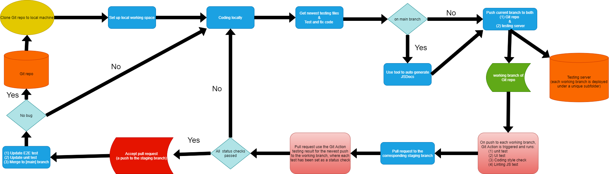

# Currently functional
1. Linting JS code via ESLint
2. Code style checking & fixing via prettier 
3. Code quality tool via Codacy
4. Human review via pull request status check
5. Unit test via jest
6. JSDocs auto generation
7. Auto deployment to DigitalOcean server via Git Hook
8. E2E test via puppeteer and jest      
# In progress
1. Updating E2E testing code based on the UI variation
2. Updating unit testing code based on backend function variation
# Workflow flowchart

# Workflow Instruction
## 1. Set up locally working environment
- (1) git clone https://github.com/cse110-fa21-group8/cse110-fa21-group8.git
- (2) cd cse110-fa21-group8/
- (3) git remote add product ssh://root@tianyuezhang1997.site/var/repo/cse110-fa21-group8.git
- (4) git checkout [YOUR_BRANCH]
- (5) npm ci
- (6) chmod a+x -R tools/
## 2. Work on your branch until you want to commit
- Before committing your work,
- Finish step 3,4,5 which includes:
- (1) First, update your testing files & tools to the newest version (if not yet)
- (2) Then, run the shell scripts inside the tools folder to help you pass the Linting & Coding style test  
(Reminder: you can press [tab] to auto-complete your typing)
## 3. Update testing files & tools in your branch
- To make sure you can easily get the newest testing files & tools, you need to have a local copy of the [testing] branch  
- Open the [testing] branch in a separate IDE window
- In that new window, run "git pull origin" to get the newest testing files
- Copy & Paste everything in the [testing] branch to replace the old testing files in [YOUR_BRANCH].  
(Hint: it's easier to do Copy & Paste outside IDE, just from one folder to the other)
## 4. Lint all JavaScript code
- (1) ./tools/lint-JS.sh
- (2) Fix your JavaScript code according to the [error] message,    
- Repeat (1) & (2) until no more [error] message
- Note: error message with "prettier-prettier" is due to wrong coding style,
you can run "./tools/fix-coding-style.sh" which is step 5-(2) to solve it. 
## 5. Check & Fix coding style
- (1) ./tools/check-coding-style.sh  
(if neither [warn] or [error] message, go directly to step 6)
- (2) ./tools/fix-coding-style.sh
## 6. Generate JSDocs 
- ./tools/create-JSDocs.sh [PATH_TO_FOLDER_CONTAINING_ALL_JS_FILES]   
- (To avoid unnecessary file conflicts, do NOT commit JSDocs  
   unless you are on the [main-staging] branch)  
- you can delete JSDocs by running : ./tools/delete-JSDocs.sh
## 7. Commit your work
- Commit your work BUT do NOT push
## 8. Deploy to testing server & Push to team repo (with one command)
- (1) ./tools/submit-my-work.sh
- (2) Input password to deploy your branch to the testing server  
(password can be found at the project-talk channel of Slack) 
## 9. Check your testing result
- (1) Go to the "Actions" section of our team repo
- (2) Find the commit you made
- (3) Click on it to see more details 
## 10. Make a pull request from [YOUR_BRANCH] to [YOUR_BRANCH-staging]
Check whether all tests passed
- If all tests pass, notify the administrator to accept your work.
- Otherwise, some tests failed. Fix them locally and resubmit your work.  
  Then, go back to this pull request to see the updated status.

