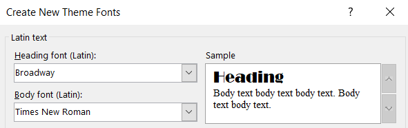

# cse110-fa21-group8
## Team Name : ***The Software Devils***
## Team Colors : ***White, Red, and Blue***
## Mascot & Logo: ***Ice Bear Devil***  

## Customize PowerPoint Theme: 
- Heading Font : Broadway
- Body Font : Times New Roman   
   
- Customize PowerPoint Background : [powerPointBackground.png](./src/powerPointBackground.png)
    
## Team Members (in alphabetical order):
- ### Adithya Telang : [Software Tester]
  > Adithya is a student at UCSD. His favorite languages are Python, Java, and C++. Especially, he is skilled in Python libraries : Opencv, Sklearn, and Numpy.
  > - *Email* : atelang@ucsd.edu
  > - *Phone Number* : N/A
  > - *Personal Github Page* : https://adittel.github.io/my_page/
- ### Amjad Al-Omar : [Software Developer & Team Leader]
  > Amjad is a student at UCSD. His favorite anime is ''Odd Taxi'', and his favorite numbers are 11, 9, 15, 1,8, and 7.
  > - *Email* : aalomar@ucsd.edu
  > - *Phone Number* : (951) 496-8660
  > - *Personal Github Page* : https://amjadalomar.github.io/GitHub-Pages/
- ### Brooks(Ruijia) Niu : [Software Developer]
  > Brooks is a third-year ***Computer Science*** & ***Cognitive Science*** double major student in Marshall college at UCSD. He is interested in machine learning, and he has been working on several projects such as gesture recognition and generative neural networks. Besides, he loves ping pong and sci-fi movies.
  > - *Email* : rniu@ucsd.edu
  > - *Phone Number* : (858) 999-6808
  > - *Personal Github Page* : https://brooksniu.github.io/CSE110/
- ### Em Nam: [UI/UX Designer]
  > Em is a student at UCSD. She is interested in Human-centric Design, UX/UI, Blockchain Technology, and Data Analysis. Besides, she likes backpacking, rock climbing, and reading, and her favorite animal is a sea turtle.
  > - *Email* : enam@ucsd.edu
  > - *Phone Number* : (415) 328-0568
  > - *Personal Github Page* : https://em-nam.github.io/GitHub-Pages/
- ### Jim(Zhi Jian) Liang : [Software Tester]
  > Jim is a student at UCSD. His favorite programming language is Java, and he likes poker, Youtube/Netflix/Anime, basketball, and Valorant.
  > - *Email* : zjliang@ucsd.edu
  > - *Phone Number* : (510)590-2684
  > - *Personal Github Page* : https://jimliang610.github.io/CSE110_LAB_1/
- ### Joanne Wu : [UI/UX Designer]
  > Joanne is a student at UCSD. She likes skating, gaming, fashion, laying on the floor, staring at the ceiling, and talking to friends, and she likes to eat ice cream, hot chips, and tapioca pudding.
  > - *Email* : jcw002@ucsd.edu
  > - *Phone Number* : (310) 989-7462
  > - *Personal Github Page* : https://wujoannec.github.io/CSE-110-Lab-1-GitHub-Pages/
- ### Jonny Tran : [UI/UX Designer]
  > Jonny is a third-year ***Computer Science*** major with a minor in ***Cognitive Science*** at UCSD. He loves programming, with a special interest in machine learning and artificial intelligence. One of his favorite aspects of programming is collaborating with other programmers. Besides programming, he likes basketball, video games, music, skateboarding, and card games.
  > - *Email* : jktran@ucsd.edu
  > - *Phone Number* : (714) 905-4296
  > - *Personal Github Page* : https://jonathanktran.github.io/CSE110-Lab1/
- ### Ryan Wright : [UI/UX Designer & Team Leader]
  > Ryan is a third-year ***Computer Science*** major at UCSD. He likes game development, making music, and drawing/sketching things. His favorite programming languages are Python, C#, and Java.
  > - *Email* : rpwright@ucsd.edu
  > - *Phone Number* : (619) 852-2664
  > - *Personal Github Page* : https://ryprogrammer.github.io/github-pages/
- ### Terry(Tianyue) Zhang : [Software Tester]
  > Terry is a senior international student from China studying at UCSD. His major is **Mathematics-Computer Science***. Before transferring to UCSD, he had studied at Shenyang University of Technology and Ohlone College for two years each. His favorite programming language is C++.
  > - *Email* : tiz013@ucsd.edu 
  > - *Phone Number* : (510) 612-4174
  > - *Personal Github Page* : https://tianyuezhang1997.github.io/tianyuezhang1997/
- ### Zachary Li Norman : [Software Developer & Team Leader]
  > Zachary is a ***Mathematics-Computer Science*** student at UC San Diego. He is a highly motivated autodidact who loves computer science. He has been a software developer for nearly ten years, and he is heading towards becoming a qualified software engineer. His computer science journey started with creating his own mods for the video game Minecraft. Outside of the world of computer science, he enjoys playing video games, watching anime, listening to audiobooks, practicing the piano, and training in Shaolin Kung Fu.
  > - *Email* : znorman@ucsd.edu
  > - *Phone Number* : (626) 627-0488
  > - *Personal Github Page* : https://zacharylinorman.github.io/